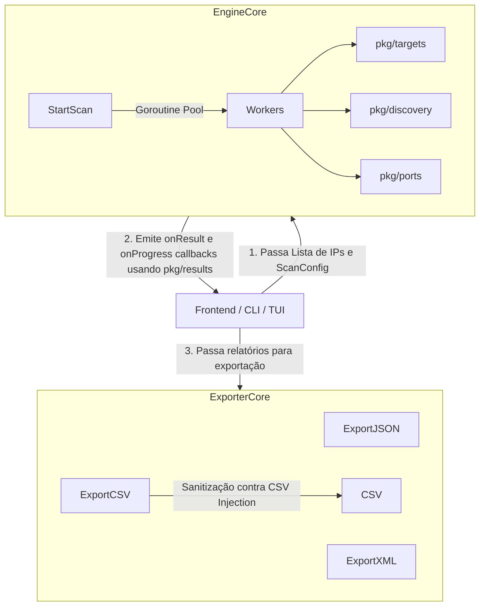

# Arquitetura: catnet-core

O `catnet-core` é o motor compartilhado de varredura e descoberta de rede para o ecossistema CatNet. Ele foi projetado para ser leve, não possuir dependências externas de terceiros (apenas a biblioteca padrão do Go) e funcionar tanto no Windows quanto em sistemas POSIX.

A ausência de abstrações de interface desnecessárias e dependências garante que ele sirva como um núcleo de alta performance para os componentes upstream (`catnet-scanner`, `catnet-tui`, `catnet`).

## Estrutura de Pacotes

A base do código é modular, dividida em pacotes focados:

### 1. `pkg/engine`
Orquestrador principal. O `StartScan` distribui a carga de trabalho para uma pool de goroutines, emitindo eventos de progresso via callback. O controle de fluxo e timeouts são garantidos por `context.Context` e controle de concorrência local, descartando estados globais ou variávies como `atomic.Bool` que causavam acoplamento.

### 2. `pkg/discovery`
Encapsula primitivas de descoberta de rede e "liveness" (Ping, GetMAC, ReverseDNS).
- *Windows*: Utiliza `syscall` para acessar a API do Windows (`iphlpapi.dll` via `SendARP`) evitando o spawn de subprocessos lentos sempre que possível.
- *POSIX*: Faz fallback para comandos do sistema operacional (`ping` e `arp` via `os/exec`) assegurando compatibilidade geral.

### 3. `pkg/ports`
Responsável pela lógica de varredura de portas (port scanning), permitindo a checagem paralela e o discover de serviços na rede.

### 4. `pkg/targets`
Isola a lógica de parsing e tratamento de alvos. Capaz de entender e traduzir sub-redes CIDR (`/24`), intervalos com hífen (`192.168.1.10-20`) e IPs unitários em blocos compatíveis para varredura.

### 5. `pkg/results`
Define as estruturas de dados canônicas do sistema (como `ScanReport` e `DeviceInfo`), atuando como contrato central para todos os módulos que produzem ou consomem resultados.

### 6. `pkg/exporter`
Separa estritamente a varredura da serialização. Recebe as structs completas (`results.DeviceInfo`) e as formata em padrões de mercado, garantindo a integridade dos dados gerados.
- Formatos suportados: `JSON`, `XML` e `CSV`.
- Segurança: A função de exportação para CSV traz sanitização embutida para mitigar vulnerabilidades de Injeção de CSV (CSV Injection), filtrando prefixos de execução maliciosa originados nas resoluções de Hostname e vendor.

## Diagrama de Execução

