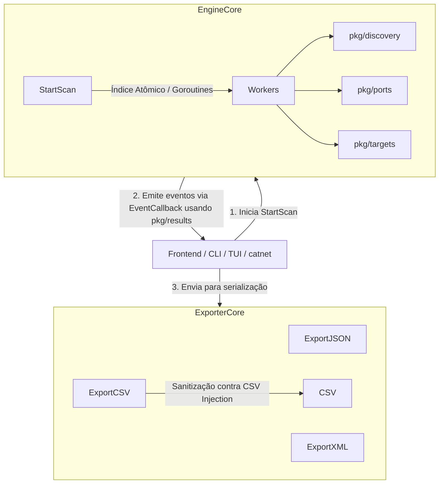

# Arquitetura: catnet-core

O `catnet-core` é o motor compartilhado de varredura e descoberta de rede para o ecossistema CatNet. Ele foi projetado para ser leve, não possuir dependências externas de terceiros (apenas a biblioteca padrão do Go) e funcionar tanto no Windows quanto em sistemas POSIX.

A ausência de abstrações de interface desnecessárias e dependências garante que ele sirva como um núcleo de alta performance para os componentes upstream (`catnet-scanner`, `catnet-tui`, `catnet`).

## Estrutura de Pacotes

A base do código é modular, dividida em 6 pacotes de domínio focados, além de utilitários internos:

### 1. `pkg/engine`
Orquestrador principal. A função `StartScan` distribui a carga de trabalho para uma pool de goroutines usando um índice atômico (`atomic.AddInt32`) para a distribuição, eliminando a necessidade de alocação de canal para cada IP. O controle de vida e timeouts são garantidos via `context.Context`. A arquitetura atual descarta estados globais.

### 2. `pkg/discovery`
Encapsula as primitivas de descoberta de rede e "liveness" (ICMP, ARP e DNS reverso).
Possui build tags separados:
- *Windows*: Utiliza chamadas nativas de sistema (`iphlpapi.dll` via `SendARP`).
- *POSIX*: Implementa um fast path lendo diretamente do `/proc/net/arp` com fallback para o comando `arp -an` via `os/exec`.

### 3. `pkg/ports`
Responsável pela varredura TCP concorrente. Implementa um semáforo de concorrência com `ScanConcurrency = 10` conexões simultâneas por IP.

### 4. `pkg/targets`
Isola a lógica de parsing e tratamento de alvos, suportando formatos CIDR (`/24`), intervalos com hífen e IPs unitários. Contém proteção contra OOM (limite máximo de 65536 IPs) e previne loops infinitos na decodificação.

### 5. `pkg/results`
Define o contrato canônico de dados do sistema (como `ScanReport` e `DeviceInfo`). Não expõe campos redundantes como `OpenPortsCount`; em seu lugar, utiliza-se o método `PortCount()`.

### 6. `pkg/exporter`
Responsável pela serialização estrita para os formatos JSON, XML e CSV. Inclui sanitização nativa para mitigar vulnerabilidades de Injeção de CSV (CSV Injection), filtrando prefixos de execução maliciosa.

### Pacotes Internos e Deprecated

- **`internal/netutil`**: Contém utilitários para validação interna de IPv4.
- **`pkg/scanner`**: Atua puramente como um shim de retrocompatibilidade e está atualmente **deprecated**.

## Diagrama de Execução

